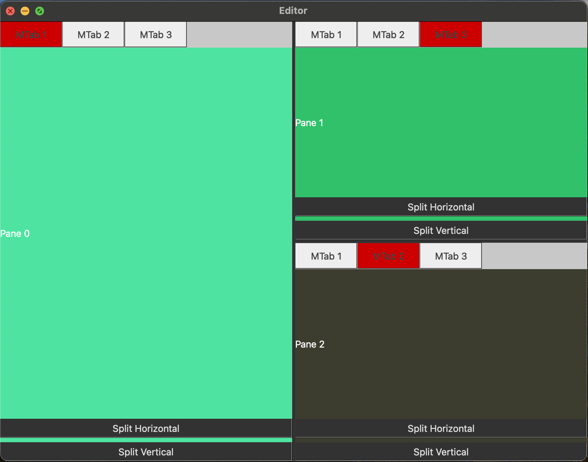

## Drag and Drop Window System using C++ with Qt
Extremely WIP
Target: learning how to make a tileable tab and window system similar to those used in code editors like VSCode and CLion
Tileable windows
Tab System

